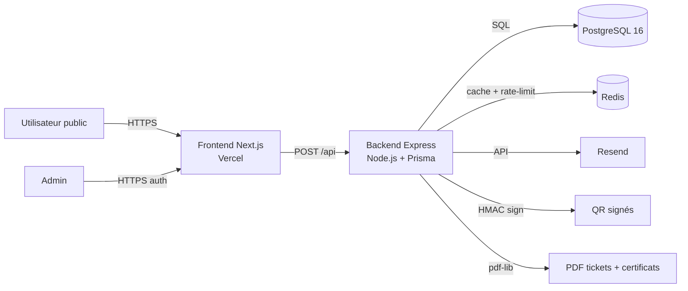
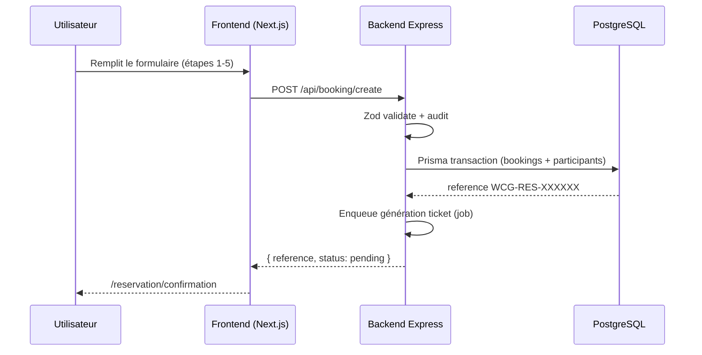
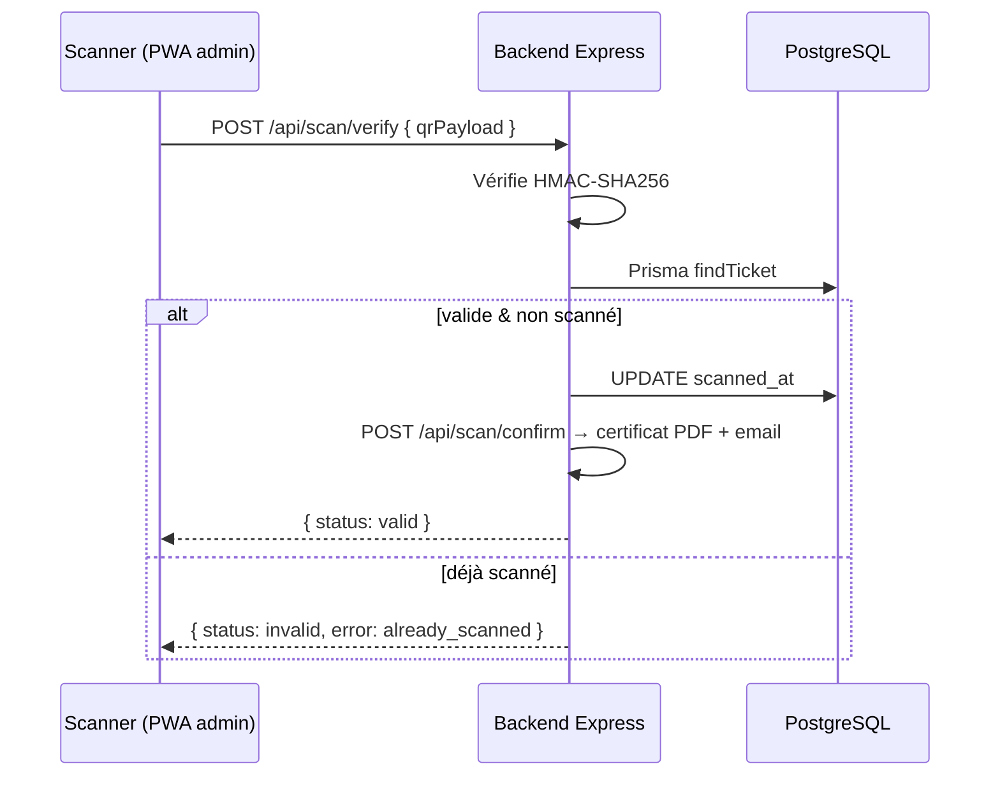
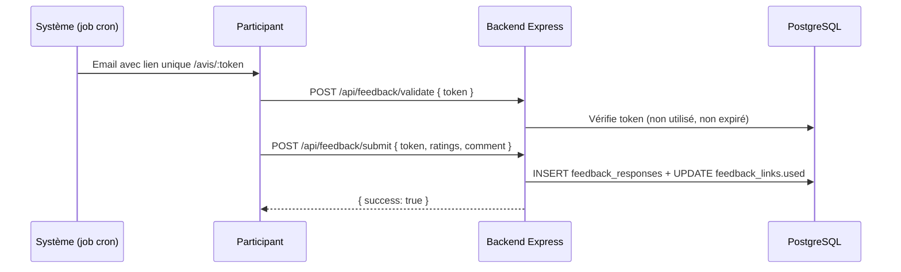

# Architecture — Work Class Gabon v1

## Vue d'ensemble

PWA Next.js 15 (App Router) déployée sur **Vercel**, adossée à un backend **Express + Prisma + Redis** (Node.js 20). PostgreSQL 16 comme base. **Toute la logique métier vit côté backend** ; le frontend ne fait que de l'affichage et des appels API typés.

**Monorepo** : `frontend/` (Next.js) + `backend/` (Express + Prisma + Redis). Le **backend Express** est l'API principale et porte **toute la logique métier** (génération PDF/QR signés HMAC, audit, rate-limit, auth admin).

> **Règle de sécurité** : toute requête manipulant des données sensibles (référence, token, id, email…) est en **POST** avec body JSON. Les GET sont réservés au healthcheck et aux ressources publiques non sensibles. Cf. `docs/ai/AI_RULES.md` § HTTP.

## Couches

| Couche                | Responsabilités                                                |
|-----------------------|----------------------------------------------------------------|
| **UI (frontend/)**    | Next.js App Router, Tailwind + shadcn, layouts publics/admin   |
| **Domaines**          | DDD : `public/*`, `admin/*`, `shared/*`                        |
| **API (backend/)**    | Express + Zod + DDD (controllers/services/repositories), JWT   |
| **Persistance**       | Prisma (ORM) + PostgreSQL + migrations SQL versionnées         |
| **Cache / rate-limit**| Redis (distribué, multi-instances)                             |

## Flux de réservation

## Flux de scan

## Flux de feedback

## Sécurité

- **JWT HS256** pour les admins (`backend/src/domains/shared/auth`).
- **bcryptjs** pour les hash de mots de passe (`Admin.passwordHash`).
- **QR codes** signés HMAC-SHA256, vérification serveur exclusive (`utils/crypto.ts` + `utils/qr-generator.ts`).
- **RLS PostgreSQL** maintenue via migrations SQL brutes (`backend/prisma/migrations/002_rls_policies/`) — défense en profondeur.
- **Audit logs** automatiques via triggers (`backend/prisma/migrations/003_audit_triggers/`) + service `auditService`.
- **IPs anonymisées** dans les logs (`utils/crypto.anonymizeIp` + Pino redact).
- **Rate-limit** distribué via Redis (`express-rate-limit` + ioredis).
- **POST obligatoire** pour toutes les données sensibles (cf. AI_RULES.md).
