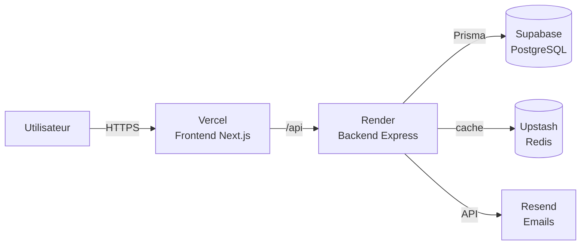

# Guide de déploiement — Work Class Gabon v1

> Architecture cible : **Vercel** (frontend) + **Render** (backend Express) + **Supabase** (PostgreSQL + Storage) + **Upstash** (Redis) + **Resend** (emails).

## Environnements

| Env         | Frontend                                  | Backend                          | DB                       |
|-------------|-------------------------------------------|----------------------------------|--------------------------|
| Dev local   | `http://localhost:3000`                   | `http://localhost:3001`          | Docker postgres          |
| Staging     | `staging.workclass-gabon.com`             | `workclass-backend-staging.onrender.com` | Supabase staging |
| Production  | `workclass-gabon.com`                     | `workclass-backend.onrender.com` | Supabase prod            |

## Vue d'ensemble



---

## ÉTAPE 1 — Préparer Supabase (PostgreSQL)

### 1.1 Créer le projet

1. Aller sur [supabase.com](https://supabase.com) → **New Project**.
2. Nom : `workclass-gabon`. Région : **eu-west-1** (Frankfurt) ou la plus proche d'Afrique de l'Ouest.
3. Mot de passe DB : générer un mot de passe fort, **le copier**.
4. Attendre ~2 min la provisioning.

### 1.2 Récupérer les connection strings (deux URLs distinctes)

Dashboard Supabase → **Settings → Database → Connection string** :

| Variable       | Mode          | Port | Usage                              |
|----------------|---------------|------|------------------------------------|
| `DATABASE_URL` | **Transaction** (pooler PgBouncer) | 6543 | Runtime — toutes les requêtes Prisma normales |
| `DIRECT_URL`   | **Session** (direct PostgreSQL) | 5432 | `prisma migrate deploy` (transactions DDL longues) |

Exemple :

```bash
# Transaction (pour DATABASE_URL) — ajouter ?pgbouncer=true&connection_limit=1
DATABASE_URL="postgresql://postgres.<REF>:<PASSWORD>@aws-0-eu-west-3.pooler.supabase.com:6543/postgres?pgbouncer=true&connection_limit=1"

# Session (pour DIRECT_URL)
DIRECT_URL="postgresql://postgres.<REF>:<PASSWORD>@aws-0-eu-west-3.pooler.supabase.com:5432/postgres"
```

### 1.3 Appliquer les migrations

Depuis ta machine locale (les migrations 002 RLS + 003 audit triggers ne sont pas dans Prisma) :

```bash
cd backend
DATABASE_URL="..." DIRECT_URL="..." npx prisma migrate deploy

# Migrations SQL brutes (RLS + audit triggers) — non gérées par Prisma
psql "$DIRECT_URL" -f prisma/migrations/002_rls_policies/migration.sql
psql "$DIRECT_URL" -f prisma/migrations/003_audit_triggers/migration.sql
```

> **À noter** : sur Render, `prisma migrate deploy` se lance **automatiquement** à chaque deploy via `preDeployCommand` (cf. `render.yaml`). Tu n'as donc à faire ça en local que pour le premier setup et pour les migrations SQL brutes.

### 1.4 Seed initial

```bash
SEED_ADMIN_PASSWORD="<mot_de_passe_admin_fort>" \
  DATABASE_URL="..." \
  npx tsx seed.ts
```

Note l'`adminId` retourné — ce sera ton compte super_admin.

---

## ÉTAPE 2 — Préparer Upstash Redis (optionnel mais recommandé)

1. [upstash.com](https://upstash.com) → **Create Database**.
2. Type : **Regional** (Frankfurt). TLS activé.
3. Copier l'URL `rediss://default:<token>@<host>.upstash.io:6380`.
4. **Sans Upstash** : retirer `REDIS_URL` de l'env Render — le rate-limit retombera in-memory (OK pour une seule instance).

---

## ÉTAPE 3 — Préparer Resend (emails)

1. [resend.com](https://resend.com) → **Add API Key**.
2. Vérifier le domaine d'envoi (`workclass-gabon.com`) via les enregistrements DNS (SPF / DKIM / DMARC).
3. Copier la clé `re_xxxxxx`.

---

## ÉTAPE 4 — Déployer le backend sur Render

### 4.1 Connecter le repo

1. [dashboard.render.com](https://dashboard.render.com) → **New → Blueprint**.
2. Connecter ton compte GitHub `DevWorkclass`.
3. Sélectionner le repo `Workclass`. Render détecte automatiquement `render.yaml`.

### 4.2 Renseigner les secrets

Render affiche les `sync: false` à compléter :

| Variable             | Valeur                                                       |
|----------------------|--------------------------------------------------------------|
| `DATABASE_URL`       | Connection string Supabase (étape 1.2)                       |
| `REDIS_URL`          | URL Upstash (étape 2) — ou vide                              |
| `FRONTEND_URL`       | URL Vercel (sera dispo après étape 5)                        |
| `APP_URL`            | Identique à `FRONTEND_URL`                                   |
| `CORS_ORIGIN`        | Identique à `FRONTEND_URL`                                   |
| `RESEND_API_KEY`     | Clé Resend (étape 3)                                         |
| `EMAIL_FROM`         | `no-reply@workclass-gabon.com`                               |
| `SEED_ADMIN_PASSWORD`| Mot de passe initial super_admin                             |

Les secrets cryptographiques (`JWT_SECRET`, `QR_HMAC_SECRET`, etc.) sont générés automatiquement par Render via `generateValue: true`.

### 4.3 Premier déploiement

1. Cliquer **Apply Blueprint**. Render build le Dockerfile (~5-8 min).
2. Récupérer l'URL : `https://workclass-backend.onrender.com`.
3. Tester : `curl https://workclass-backend.onrender.com/api/health`.

> **Cold start** : le plan `starter` (gratuit) endort le service après 15 min d'inactivité (réveil ~30 s). Pour la prod : passer au plan `standard`.

---

## ÉTAPE 5 — Déployer le frontend sur Vercel

### 5.1 Importer le projet

1. [vercel.com/new](https://vercel.com/new) → importer `DevWorkclass/Workclass`.
2. Framework Preset : **Next.js** (auto-détecté grâce à `vercel.json`).
3. **Root Directory** : laisser `.` (vercel.json gère les workspaces).

### 5.2 Variables d'environnement

Onglet **Environment Variables** :

| Variable                       | Valeur                                                |
|--------------------------------|-------------------------------------------------------|
| `NEXT_PUBLIC_APP_NAME`         | `Work Class Gabon`                                    |
| `NEXT_PUBLIC_APP_URL`          | `https://workclass-gabon.vercel.app` (ou domaine)     |
| `NEXT_PUBLIC_APP_ENV`          | `production`                                          |
| `NEXT_PUBLIC_DEFAULT_LOCALE`   | `fr`                                                  |
| `NEXT_PUBLIC_API_URL`          | `https://workclass-backend.onrender.com/api`          |

### 5.3 Déploiement

1. **Deploy**. Vercel build (~3-5 min).
2. Récupérer l'URL `https://workclass-gabon.vercel.app`.
3. Tester l'accueil + un appel API (DevTools Network).

### 5.4 Boucler Render ↔ Vercel

Retourner sur Render → **workclass-backend → Environment** → mettre à jour :

- `FRONTEND_URL = https://workclass-gabon.vercel.app`
- `APP_URL = https://workclass-gabon.vercel.app`
- `CORS_ORIGIN = https://workclass-gabon.vercel.app`

Render redéploie automatiquement.

---

## ÉTAPE 6 — Domaine custom

### Vercel (frontend)

1. **Settings → Domains** → ajouter `workclass-gabon.com`.
2. Configurer les DNS chez le registrar :
   - `A @ 76.76.21.21`
   - `CNAME www cname.vercel-dns.com`

### Render (backend)

1. **workclass-backend → Settings → Custom Domains** → ajouter `api.workclass-gabon.com`.
2. DNS : `CNAME api workclass-backend.onrender.com`.
3. Mettre à jour Vercel : `NEXT_PUBLIC_API_URL=https://api.workclass-gabon.com/api`.

---

## ÉTAPE 7 — Vérifications post-déploiement

### Sanity checks

```bash
# Healthcheck backend
curl https://api.workclass-gabon.com/api/health

# Frontend
curl -I https://workclass-gabon.com

# Test création réservation (provoque erreur 422 attendue)
curl -X POST https://api.workclass-gabon.com/api/bookings -H "Content-Type: application/json" -d '{}'
```

### Checklist sécurité

- [ ] HTTPS partout (forcé par Vercel + Render)
- [ ] Variables `JWT_SECRET`, `QR_HMAC_SECRET` générées par Render (pas en clair en repo)
- [ ] `CORS_ORIGIN` strictement égal à l'URL frontend (pas de `*`)
- [ ] Connexion Supabase utilise SSL (par défaut `?sslmode=require`)
- [ ] Rate-limit actif (`curl` 101 fois en 15 min → 429)
- [ ] Audit log écrit (vérifier `select * from audit_logs limit 5` dans Supabase SQL editor)
- [ ] DKIM / SPF Resend validés (envoyer un test depuis le backend)

---

## ÉTAPE 8 — CI/CD GitHub Actions

Les workflows `.github/workflows/ci-{frontend,backend}.yml` sont déjà configurés. À chaque PR vers `main` :

- Lint + typecheck + build des deux workspaces.
- Backend : services postgres + redis spin-up, `prisma generate` puis tests.

Render et Vercel sont configurés en **auto-deploy** sur `main` → toute PR mergée déclenche un déploiement.

---

## Rollback

### Vercel

Dashboard → **Deployments** → cliquer une version antérieure → **Promote to Production**.

### Render

Dashboard → **Events** → cliquer un build réussi antérieur → **Rollback to this deploy**.

### Supabase

Restaurer un point-in-time : **Database → Backups → Point in Time Restore** (plan Pro requis).

Pour annuler une migration Prisma : créer une **nouvelle** migration qui inverse les changements (`npx prisma migrate dev --name rollback_xxx`). Ne jamais `prisma migrate reset` en prod.

---

## Coûts indicatifs (mensuel, plans entry)

| Service  | Plan          | Coût      |
|----------|---------------|-----------|
| Vercel   | Hobby         | Gratuit   |
| Render   | Starter       | $7        |
| Supabase | Free          | Gratuit (500 MB) |
| Upstash  | Pay-as-you-go | ~$0-2     |
| Resend   | Free          | Gratuit (3 000 emails/mois) |
| **Total**| —             | **~$7-9** |

Pour la prod sérieuse : Render Standard ($25), Supabase Pro ($25), Resend Pro ($20).

---

## Aide

- **Render logs** : Dashboard → workclass-backend → **Logs** (live).
- **Vercel logs** : Dashboard → workclass-gabon → **Logs** (par déploiement).
- **Supabase SQL editor** : Dashboard → SQL Editor (queries directes).
- **Prisma Studio** local pointé sur Supabase : `DATABASE_URL=... npx prisma studio`.
